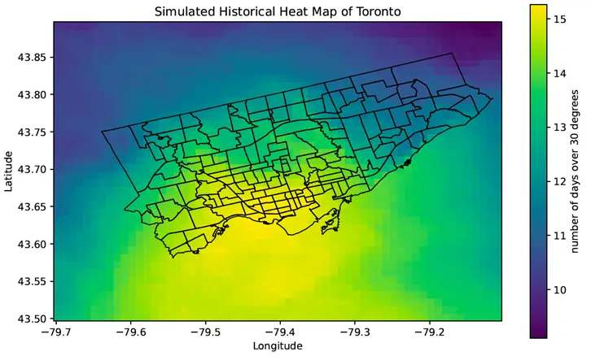
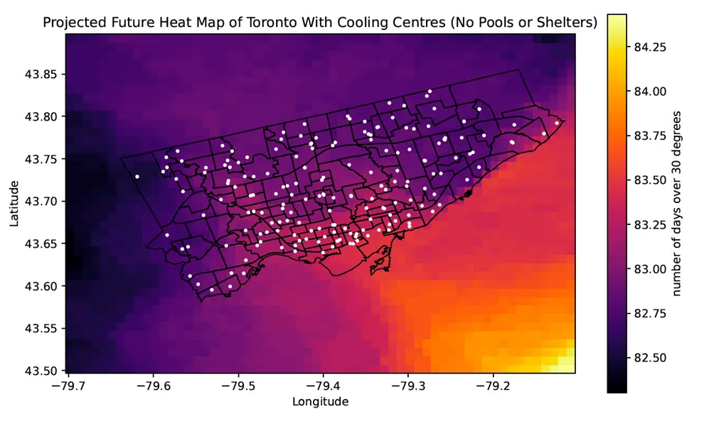

# UofT Climate Hackathon 2024

[Github repo](https://github.com/samudra-perera/UofT-Climate-Hacks)

## Purpose

The purpose of the hackathon was to tackle pressing climate issues with the use of technology. Topics included drought mitigation strategies, snowfall cleanup, and globl warming. This also happened to be the first hackathon I ever participated in.

## Problem Statement

Estimate optimal cooling station locations for the City of Toronto based on summertime hot days in the future (2071 to 2100) using downscaled CanESM5 data.

## Results

Based on the findings from our model, we chose to place cooling centers where there were no existing solutions, and that overlaid with low socio-economic areas. For our solution, we identified key locations owned by the City of Toronto that would be converted to makeshift cooling centers in these high risk areas.

Above is what the current heat map looks like for the city with the average number of degree days above 30 per year. Below is the downscaled forecasted heatmap, with an overlay of the cooling centers in the City of Toronto.

## Something Cool I Learned

Climate models take a HUGE amount of data and can [take weeks if not months to model.](https://theconversation.com/climate-models-can-run-for-months-on-supercomputers-but-my-new-algorithm-can-make-them-ten-times-faster-229041#:~:text=The%20simulations%20take%20time%2C%20frequently,the%20fight%20against%20climate%20change.) In order for us to model the City of Toronto's climate forecast, we took an existing global climate model (GCM) then downscaled the data to fit our region. Specifically, we used a technique called statisical downscaling. Statistical downscaling was used alongside our historical weather data and our GCM to increase the resolution of our model to fit our geogridded data.

#### Shout Out To The squad

Huge shoutout to my teammates: Mevan Solanga, Asli Bese, and Peter Angelinos!
