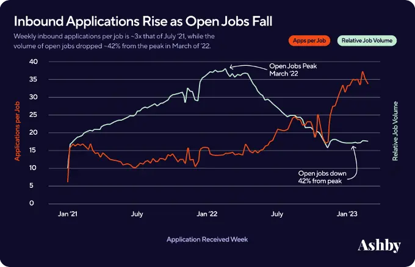

# HawkHacks 2024 - Transparence

[Github Repo](https://github.com/Mevan-Solanga/Transparence)

## Why Do We Need Employment Verification?

Our team decided to build this application to combat employment fraud. With growing competition candidates are more incentivized than ever to lie on their resumes.
With the candidate pools for skilled jobs constantly growing, people are resorting to any tactic to get ahead. Over **40%** of job seekers have reported consistenly lying on their resumes to pass resume screenings.

## Our Solution

Our solution for this rampant problem is to create a platform for verification. The platform provides a simple interface for current and past employees to request verification of employment and achievements from employers.
When the employer validates the request a NFT is minted and sent to the wallet of the requested user. This NFT can then be presented on resumes and social media platforms as a form of verification.

## Results

Amongst over 900 participants and over 160 teams our team was able to secure the best use case from the judges. Our win came with a $1700 cash prize so that was a huge bonus.
