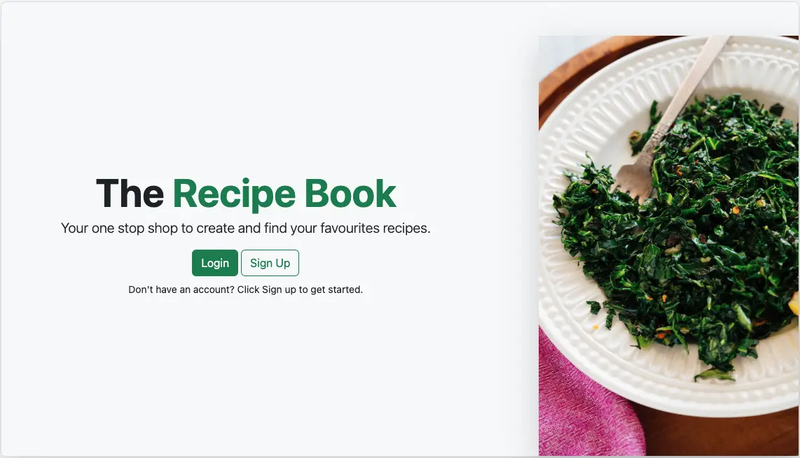

# The Recipe Book

[Deployed](https://therecipebook.cyclic.app/)  
[Github Repo](https://github.com/samudra-perera/The-Recipe-Book)

## How it was built

This app was built to learn about REST APIs and performing simple CRUD operations. This web app was built using MVC architecture. The templating language is Embedded JavaScript (EJS), with a Node/Express server calling on a MongoDB datatbase.
