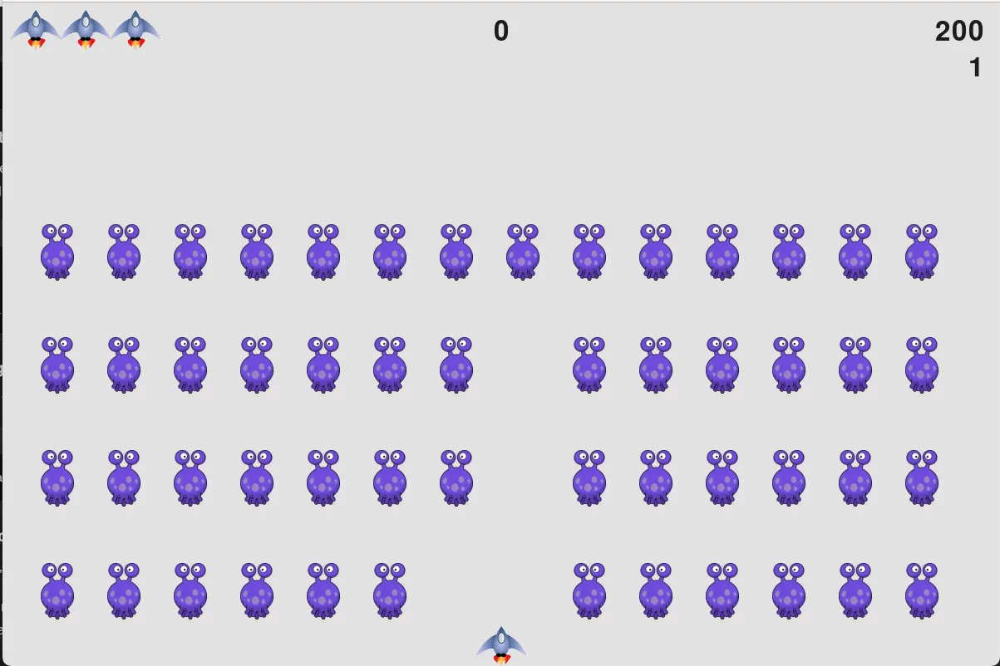

# Space Invaders

[Github Repo](https://github.com/samudra-perera/Alien-Invasion)

## What is Space Invaders?

Space invaders is one of the most iconic games of all time. It was first released in 1978 as a arcade game and was considered the first fixed shooter game ever. The goal is to defeat waves of descending aliens with a horizontally moving laser cannon.

## Technology Used

The game was built using Python with OOP practices. The Pygame libary was used to calculate the position of all game assets, perform collision detection and rendering the view.
