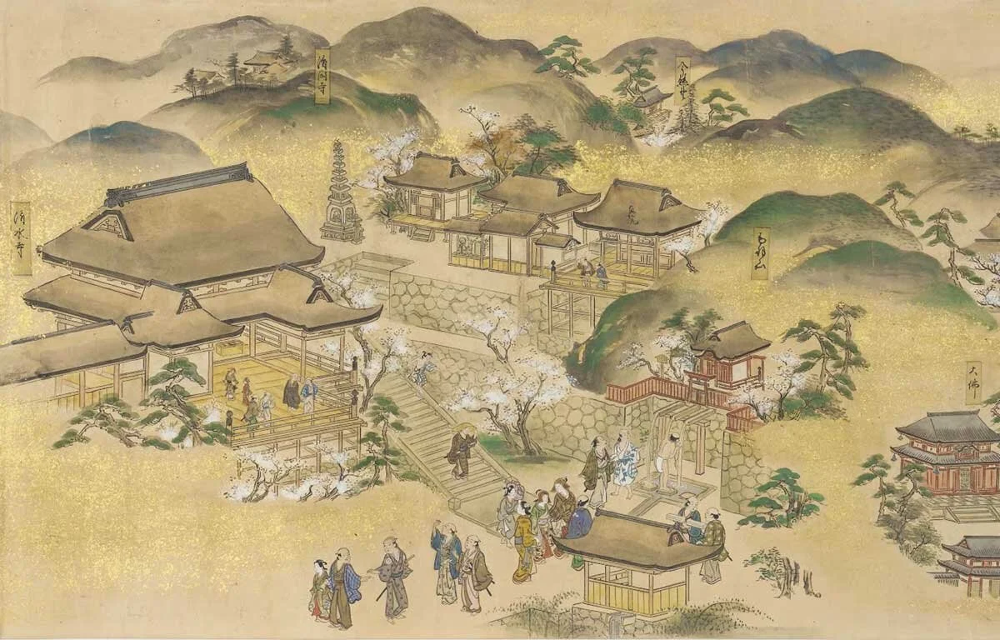

# The Plan for Summer 2024

Lets breakdown the goals for the summer into three themes: Health and Wellness, Programming and Hobbies. At then end of the summer, I'll take a look at how close I was to meeting the goals I set out in this post and reflect on the results.

## Health and Wellness

This is pretty all encompassing term. So lets break this one further down into Physical and Mental health.

### Physical Health

Ever since I got back into school my physical has been on a downward trend-- this is no ones fault but my own. I have been making consistent excuses to avoid physical activity. This includes neglecting, my diet, water intake and, sleep habits. I went from 165lb at the start of 2023 to 187lb by February 2024. The goal is to get back to sub 165lbs. At the time of writing this post I am 176.4lb.

Anyone that knows anything about physical fitness knows that weight is only one metric of being healthy. Two other areas I want to improve on is my cardiovascular health and my _footy_ grind. The goals here are to run once per week (minimum 5km) and play soccer at least twice per week. This might be ambitious so lets see.

### Mental Health

The big thing is here is getting [good consistent sleep](https://www.columbiapsychiatry.org/news/how-sleep-deprivation-affects-your-mental-health). I have noticed getting a solid 8+ hours of continous non disturbed sleep had me feeling like a superhero the following day. Sleep is the foundation for the day. If you have a crap foundation, you're gonna have a crap day.

## Programming Goals

I have three major goals here. The first is to participate in another Hackathon. I had a blast at UofT's Climate Hacks, and I want to compete in that environment again. Next, is to build an end to end AI model. I think there is a couple of ways to go about doing this; through school and through [Spingle.](https://spingle.ai/) Finally, I want to work on a small project over the summer. The shortlist so far is a collision simulator or a NFT based tamagachi game.

## Hobbies

Short and sweet I got to tap back into my creativity. I have been brainstorming on how to potentially blend some creative ideas with technology and kill two birds with one stone. Other than that, I just
need to do.

I want to consistently write on this personal site about a variety of topics. Constant days of writing code has dulled my writing skill.

Oh, and reading 5 books would be great.

\*First Released: May 13, 2024\*  
\*Last Edited: May 13, 2024\*
