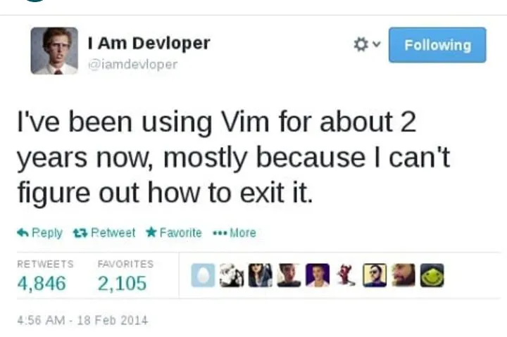

# From VSCode to Vim

## How It Started

The first time I ever used Vim I was like this meme. I am like WTF is going on here. There was no mouse,
there were all these weird key commands, and worst of all no syntax highlighting. I remember I needed to quickly
add a semi-colon to my c++ program and spendng what felt like forever moving my cursor where it needed to go.
Then I felt like it was my first time using a keyboard using one finger to click **i** and **w** so precisly not to
screw anything up. After I somehow exited, I breathed a sigh of relief and swore to myself never again.

## How It's Going

Fast forward a few months from that moment and here I am. I been daily driving NeoVim for 2 weeks and I can honestly say I will probably never go
back. Apart from the fact that using Vim makes me feel like a cool hacker man, the lack of all the UI features lets me lock in without
distraction. The commands I thought were annoying feel like [Mortal Kombat](https://en.wikipedia.org/wiki/Mortal_Kombat) now and I find myself trying to string
together new combos. FATALITY! Not only do I feel more focused as a dev, I find that using Vim has helped me navigate the terminal quicker and
use my computer more effectively. I have only started on my Vim journey, but I am pleased to say I can FINALLY exit Vim.

### Special Thanks

[ThePrimeagen](https://www.youtube.com/c/theprimeagen) for getting me to try out Vim, and to [Josean Martinez](https://www.youtube.com/channel/UC_NZ6qLS9oJgsMKQhqAkg-w) for his nvim configuration.

\*First Released: May 22, 2024\*
